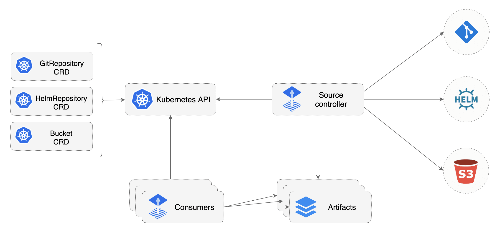
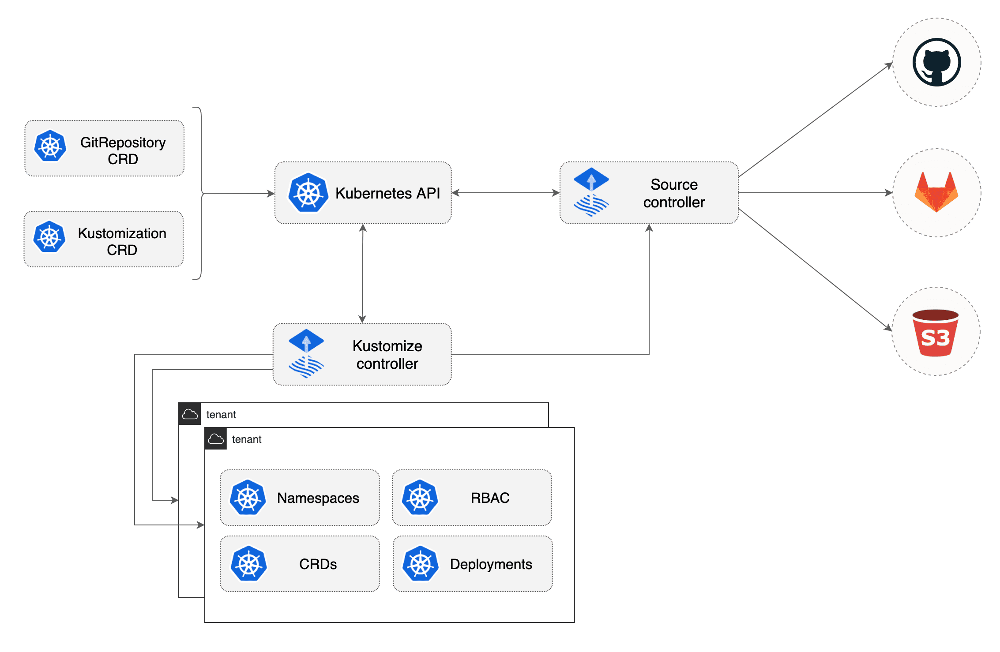

## Flux for GitOps deployment

Setup Flux on your Kubernetes cluster



---

### Requirements

```bash
# minikube installation
curl -LO https://storage.googleapis.com/minikube/releases/latest/minikube-latest.x86_64.rpm
sudo rpm -ivh minikube-latest.x86_64.rpm
# flux installation
curl -s https://toolkit.fluxcd.io/install.sh | sudo bash
# enable completions in ~/.bash_profile
. <(flux completion bash)
```


----

### Starting required services

```bash
export KUBECONFIG=~/.kube/config
minikube start
kubectl cluster-info
flux check --pre
```

---

### Install Flux on your k8s cluster

```console
[foo@bar]$ flux bootstrap gitlab \
  --hostname=my-gitlab.com \
  --token-auth \
  --owner=my-gitlab-group \
  --repository=my-repository \
  --branch=master \
  --path=clusters/my-cluster
```


Or for development purposes:

```console
[foo@bar]$ flux install
```

Note: Using the flux bootstrap command you can install Flux on a Kubernetes cluster and configure it to manage itself from a Git repository. If the Flux components are present on the cluster, the bootstrap command will perform an upgrade if needed. The bootstrap is idempotent, it's safe to run the command as many times as you want.


---

### Load your SOPS key on your cluster


```bash
gpg --export-secret-keys --armor ${KEY_ID} | kubectl create secret generic sops-gpg --namespace=flux-system --from-file=sops.asc=/dev/stdin
```

----

#### Key generation

```bash
gpg --batch --full-generate-key <<EOF
%no-protection
Key-Type: 1
Key-Length: 4096
Subkey-Type: 1
Subkey-Length: 4096
Expire-Date: 0
Name-Comment: ${KEY_COMMENT}
Name-Real: ${KEY_NAME}
EOF
```

---

### Add an existing repository

```bash
flux create source git ${SRC_NAME} \
  --url=${REPO_URL} \
  --branch=${REPO_BRANCH}
```

Is equal to/generate:

```yaml
apiVersion: source.toolkit.fluxcd.io/v1beta1
kind: GitRepository
metadata:
  name: SRC_NAME
  namespace: flux-system
spec:
  gitImplementation: go-git
  interval: 1m0s
  ref:
    branch: REPOSITORY_BRANCH
  timeout: 20s
  url: REPOSITORY_URL
```

---

### Deploy your kustomize manifests



----


---


##### Declare a kustomization deployment with Sops decryption

```bash
flux create kustomization ${KUSTOMIZE_NAME} \
  --source=GitRepository/${SRC_NAME} \
  --path=${MANIFESTS_PATH} \
  --prune=true \
  --interval=10m \
  --decryption-provider=sops \
  --decryption-secret=sops-gpg
```

Is equal to/generate:

```yaml
apiVersion: kustomize.toolkit.fluxcd.io/v1beta1
kind: Kustomization
metadata:
  name: KUSTOMIZATION_NAME
  namespace: flux-system
spec:
  decryption:
    provider: sops
    secretRef:
      name: sops-gpg
  interval: 10m0s
  path: MANIFESTS_PATH
  prune: true
  sourceRef:
    kind: GitRepository
    name: SRC_NAME
```

Note: **SOPS**: https://toolkit.fluxcd.io/guides/mozilla-sops/ **FLUX-KUSTOMIZE**: https://github.com/fluxcd/kustomize-controller/tree/main/docs/spec

---


#### Check your resources

```console
[foo@bar]$ flux get sources git
NAME READY MESSAGE                                                         REVISION                                      SUSPENDED
test True  Fetched revision: main/9b11bf3c6731792f79bb057490bf75114f9ee462 main/9b11bf3c6731792f79bb057490bf75114f9ee462 False
[foo@bar]$ flux get kustomizations
NAME   READY MESSAGE                                                         REVISION                                      SUSPENDED
testkustomize  True  Applied revision: main/9b11bf3c6731792f79bb057490bf75114f9ee462 main/9b11bf3c6731792f79bb057490bf75114f9ee462 False
```